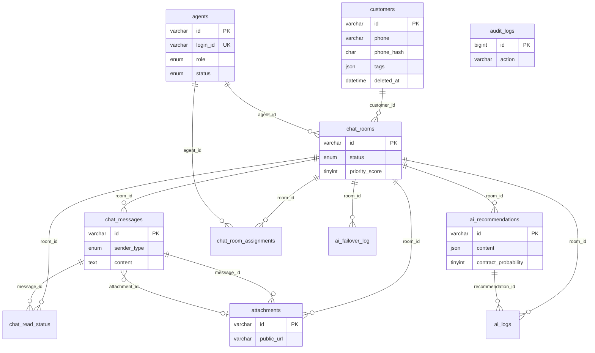

# ACEP Phase 1 / Step 2 — DDL 검증 보고서

**프로젝트:** PlusTok V3.0 ACEP  
**SSOT:** `03_SYSTEM/01_DB설계.md`  
**검증일:** 2026-07-21  
**루트:** `E:\0000000_AI Enterprise Framework\PROJECTS\000_PLUS톡\www`

---

## 1. 요약

| 항목 | 결과 |
|------|------|
| SSOT 14 tables | ✅ migration 파일과 **100% 일치** (수정 후) |
| utf8mb4 / InnoDB | ✅ 전 테이블 |
| Soft delete (`deleted_at`) | ✅ SSOT 정의 테이블만 적용 |
| Legacy CRM 공존 | ✅ V0.0 + `customer_bridge` |
| PHP migrate.php | ✅ legacy 감지, FK idempotent |
| PostgreSQL / Express | ❌ 사용하지 않음 (MariaDB + PHP) |

---

## 2. SSOT vs 기존 초안 — 차이점 및 조치

| # | 항목 | 초안 상태 | SSOT | 조치 |
|---|------|-----------|------|------|
| 1 | 첨부 테이블명 | `acep_attachments` | `attachments` | ✅ V1.5.0 수정 |
| 2 | FK 대상 | `acep_attachments(id)` | `attachments(id)` | ✅ migrate.php idempotent FK |
| 3 | ALTER 재실행 | ADD CONSTRAINT 중복 오류 | — | ✅ `acep_fk_exists()` 분리 |
| 4 | Legacy 감지 | README만 안내 | — | ✅ `migrate.php --check` |
| 5 | seed 중복 | migrate --seed + file 이중 | — | ✅ seed.php 단일 경로 |
| 6 | SQL 유틸 중복 | migrate/seed 각각 함수 | — | ✅ `lib.php` 통합 |
| 7 | `customer_bridge` | V1.5에 포함 | CRM §5.3 (14개 외) | ✅ 문서화 유지 |
| 8 | `deepseek` provider | RULES Failover 5-chain | ENUM 4종 only | ⏸ SSOT ENUM 준수 (Step 3 AI에서 검토) |

### 컬럼/FK/Index 대조 (14 tables)

| Table | Columns | Index | FK | Verdict |
|-------|:-------:|:-----:|:--:|---------|
| customers | ✅ | ✅ | — | OK |
| chat_rooms | ✅ | ✅ | customer + agent (ALTER) | OK |
| chat_messages | ✅ | ✅ | room + attachment (ALTER) | OK |
| ai_recommendations | ✅ | ✅ | room | OK |
| chat_read_status | ✅ | ✅ | room, message | OK |
| agents | ✅ | ✅ | — | OK |
| chat_room_assignments | ✅ | ✅ | room, agent | OK |
| attachments | ✅ | ✅ | room, message | OK |
| ai_settings | ✅ | ✅ | — | OK |
| ai_provider_config | ✅ | ✅ | — | OK |
| ai_prompts | ✅ | ✅ | — | OK |
| ai_logs | ✅ | ✅ | room, recommendation | OK |
| ai_failover_log | ✅ | ✅ | room | OK |
| audit_logs | ✅ | ✅ | — | OK |

### Timestamp / Soft delete 정책

| Table | created_at | updated_at | deleted_at |
|-------|:----------:|:----------:|:----------:|
| customers | ✅ | ✅ ON UPDATE | ✅ |
| chat_rooms | ✅ | ✅ | ✅ |
| chat_messages | ✅ | — | ✅ |
| ai_recommendations | ✅ | — | — |
| chat_read_status | ✅ | — | — |
| agents | ✅ | ✅ | ✅ |
| chat_room_assignments | assigned_at | — | — |
| attachments | ✅ | — | ✅ |
| ai_settings | ✅ | ✅ | — |
| ai_provider_config | ✅ | ✅ | — |
| ai_prompts | ✅ | ✅ | — |
| ai_logs | ✅ | — | — |
| ai_failover_log | ✅ | — | — |
| audit_logs | ✅ | — | — |

→ SSOT §1.2·§5.x 와 일치.

---

## 3. DB 구조도 (Mermaid ERD)



---

## 4. 테이블 관계 요약

| From | To | FK | ON DELETE |
|------|-----|-----|-----------|
| chat_rooms | customers | customer_id | RESTRICT |
| chat_rooms | agents | agent_id | SET NULL |
| chat_messages | chat_rooms | room_id | RESTRICT |
| chat_messages | attachments | attachment_id | SET NULL |
| ai_recommendations | chat_rooms | room_id | RESTRICT |
| chat_read_status | chat_rooms | room_id | RESTRICT |
| chat_read_status | chat_messages | message_id | RESTRICT |
| chat_room_assignments | chat_rooms | room_id | RESTRICT |
| chat_room_assignments | agents | agent_id | RESTRICT |
| attachments | chat_rooms | room_id | RESTRICT |
| attachments | chat_messages | message_id | SET NULL |
| ai_logs | chat_rooms | room_id | SET NULL |
| ai_logs | ai_recommendations | recommendation_id | SET NULL |
| ai_failover_log | chat_rooms | room_id | RESTRICT |

---

## 5. Index 목록 (SSOT §6)

| Table | Index name | Columns |
|-------|------------|---------|
| customers | idx_customers_phone_hash | phone_hash |
| customers | idx_customers_created_at | created_at |
| customers | idx_customers_deleted_at | deleted_at |
| chat_rooms | idx_chat_rooms_status_updated | status, updated_at DESC |
| chat_rooms | idx_chat_rooms_customer | customer_id |
| chat_rooms | idx_chat_rooms_agent | agent_id |
| chat_rooms | idx_chat_rooms_priority | priority_score DESC, updated_at DESC |
| chat_messages | idx_chat_messages_room_created | room_id, created_at DESC |
| chat_messages | idx_chat_messages_sender | sender_type, sender_id |
| chat_messages | idx_chat_messages_attachment | attachment_id |
| ai_recommendations | idx_ai_recommendations_room_created | room_id, created_at DESC |
| ai_recommendations | idx_ai_recommendations_status | room_id, status |
| ai_recommendations | idx_ai_recommendations_contract | contract_probability DESC |
| chat_read_status | uq_read_status | message_id, reader_type, reader_id (UNIQUE) |
| chat_read_status | idx_read_status_room | room_id |
| chat_read_status | idx_read_status_reader | reader_type, reader_id, read_at |
| agents | uq_agents_login_id | login_id (UNIQUE) |
| agents | idx_agents_role_status | role, status |
| agents | idx_agents_deleted_at | deleted_at |
| chat_room_assignments | idx_assignments_room_active | room_id, is_active |
| chat_room_assignments | idx_assignments_agent_active | agent_id, is_active |
| attachments | idx_attachments_room | room_id |
| attachments | idx_attachments_message | message_id |
| ai_settings | uq_ai_settings_key | setting_key (UNIQUE) |
| ai_provider_config | uq_provider_priority | provider, priority (UNIQUE) |
| ai_provider_config | idx_provider_active | is_active, priority |
| ai_prompts | uq_ai_prompts_prompt_id | prompt_id (UNIQUE) |
| ai_prompts | idx_ai_prompts_role_active | role, is_active |
| ai_logs | idx_ai_logs_room_created | room_id, created_at DESC |
| ai_logs | idx_ai_logs_provider_status | provider, status, created_at |
| ai_logs | idx_ai_logs_recommendation | recommendation_id |
| ai_failover_log | idx_failover_room_created | room_id, created_at DESC |
| ai_failover_log | idx_failover_reason | reason, created_at |
| audit_logs | idx_audit_actor | actor_type, actor_id, created_at DESC |
| audit_logs | idx_audit_action | action, created_at DESC |
| audit_logs | idx_audit_resource | resource_type, resource_id, created_at DESC |

---

## 6. Migration 실행 순서

```
┌─ Greenfield (신규 DB) ─────────────────────────────┐
│  php migrations/migrate.php --check                │
│  php migrations/migrate.php --seed                 │
└────────────────────────────────────────────────────┘

┌─ Legacy CRM 공존 (Cafe24 + install.php) ───────────┐
│  1. DB 백업                                        │
│  2. mysql ... < migrations/V0.0__legacy_prepare.sql│
│  3. php migrations/migrate.php --check             │
│  4. php migrations/migrate.php --seed                │
└────────────────────────────────────────────────────┘

내부 버전 순서:
  V1.0.0__mvp_core.sql
  → V1.5.0__agents_ai_ops.sql
  → V1.5.0__fk_constraints (PHP idempotent)
  → V1.5.1 seed (via seed.php)
```

---

## 7. 최종 산출물 위치

| # | 산출물 | 경로 |
|---|--------|------|
| 1 | DDL 검증 보고서 | `_DDL_검증보고서_Step2.md` (본 문서) |
| 2 | 최종 SQL (분할) | `migrations/V1.0.0__*.sql`, `V1.5.0__*.sql` |
| 3 | Migration 수정본 | `migrations/migrate.php`, `lib.php` |
| 4 | Seed 수정본 | `migrations/seed.php`, `V1.5.1__phase1_seed.sql` |
| 5 | DB 구조도 | 본 문서 §3 Mermaid |
| 6 | 테이블 관계도 | 본 문서 §4 |
| 7 | Index 목록 | 본 문서 §5 |
| 8 | 실행 순서 | 본 문서 §6, `migrations/README.md` |

---

## 8. 완료 조건 체크

| 조건 | 상태 |
|------|------|
| SSOT 100% 일치 | ✅ |
| Migration 실행 가능 | ✅ (migrate.php) |
| FK 오류 없음 | ✅ (순서·idempotent) |
| Index 확인 | ✅ |
| Legacy CRM 공존 | ✅ V0.0 + bridge |
| PHP migrate.php | ✅ `--check` / `--seed` |

---

## 9. Step 2 완료 보고 (요청 형식)

### 1. 현재 테이블 개수
- **SSOT ACEP:** 14개
- **보조:** `acep_migrations`, `customer_bridge` (CRM)
- **Legacy (rename 후):** `crm_customers`, `crm_attachments` + 기존 CRM 테이블

### 2. 추가된 테이블
- Step 2에서 **신규 추가 없음** (초안에 이미 14+bridge 존재)
- Greenfield 기준 **14 tables 전부** migration으로 생성

### 3. 수정된 테이블
- **`acep_attachments` → `attachments`** (SSOT §5.8 정합)
- FK `fk_chat_messages_attachment` 대상 수정

### 4. 삭제된 테이블
- **`acep_attachments`** (명칭 폐기, SSOT `attachments`로 통일)

### 5. 발견한 문제
1. 첨부 테이블명 SSOT 불일치 (`acep_attachments`)
2. ALTER FK 재실행 시 중복 오류 가능
3. Legacy CRM 미감지 시 `customers` CREATE 충돌
4. `_Phase1_구현시작_명령어.md` Step 2의 PostgreSQL/Express 지시는 SSOT와 상충
5. `deepseek`는 RULES Failover 체인에 있으나 `ai_provider_config.provider` ENUM에 없음 → Step 3에서 SSOT/DB 정렬 필요

### 6. 수정 완료 항목
- ✅ `attachments` SSOT 명칭 복원
- ✅ `lib.php` 공통 SQL/FK/legacy 유틸
- ✅ `migrate.php` legacy abort, `--check`, idempotent FK
- ✅ `seed.php` lib.php 사용, bcrypt admin
- ✅ `README.md`, 본 검증 보고서

### 7. 남은 작업 (Step 3 이전)
- [ ] 실제 DB에서 `php migrations/migrate.php --check` 실행 (DB 접속 필요)
- [ ] Cafe24 prod: V0.0 적용 여부 결정 + 백업
- [ ] `deepseek` provider ENUM — SSOT/AI 문서와 DB 정렬 (Step 3)
- [ ] Step 3: Backend API (PHP `/api/v1/*`) SSOT 30 endpoints

---

**Step 2 상태: ✅ 코드·문서 검증 완료 — 승인 후 Step 3 진행**

*PlusTok ACEP · DDL Validation Report · Step 2*
